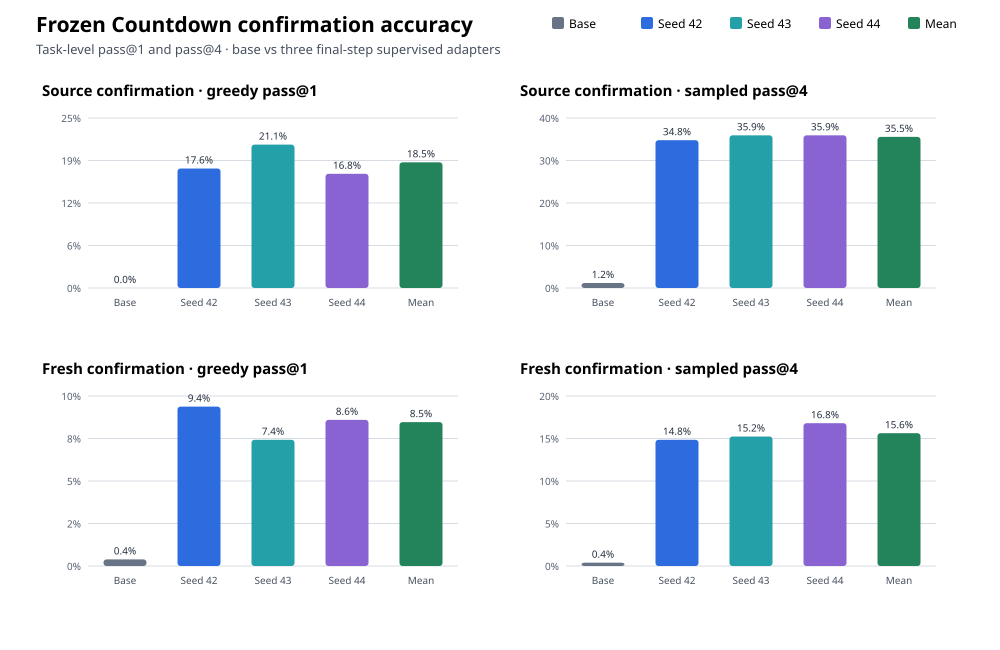
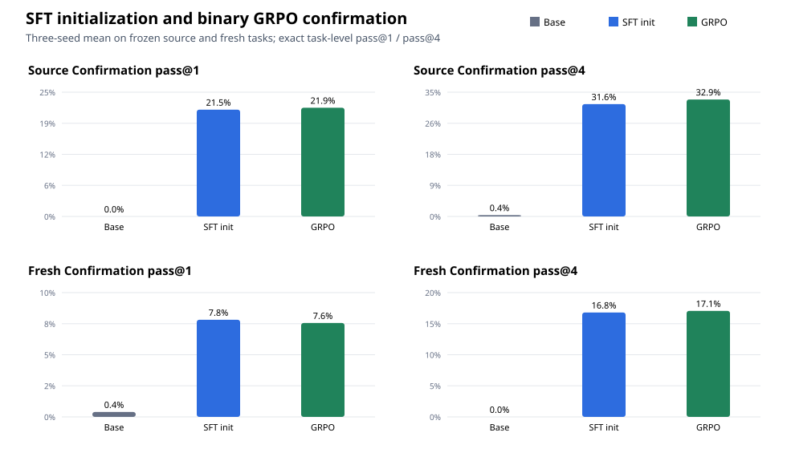

# Learning to solve Countdown: a small-model study

The project began with one question: can [`Qwen/Qwen3.5-0.8B-Base`](https://huggingface.co/Qwen/Qwen3.5-0.8B-Base)
learn held-out Countdown tasks with TRL GRPO and a binary exact reward, without
supervised Countdown solutions? That lower-bound experiment, motivated by
[TinyZero](https://github.com/Jiayi-Pan/TinyZero), remains part of the study.
After its sparse-reward gate failed, the user authorized a separately named
learning extension with alternative methods. The original base/no-SFT/GRPO
result stays intact and is never credited with the extension's gains. See the
[2026-09-18 protocol amendment](docs/amendment-2026-09-18.md).

## Current result: supervised initialization improves held-out solving

The extension trained completion-only LoRA adapters on 4,096 verified,
train-only Countdown solutions, starting from the pinned Qwen3.5-0.8B-Base
checkpoint. Each of three seeds trained for 512 steps. The final checkpoints
were frozen before evaluating 256 unseen source tasks and 256 independently
generated solvable tasks. Oracle witnesses appeared only as training targets;
they were not added to prompts or evaluation inputs.

The untouched base and each adapter received one greedy completion and four
sampled completions per task with the same raw prompt, 128-token limit,
temperature 1.0, top-p 0.95, and generation seeds. Each model produced 2,560
scored records. None of the three adapter runs truncated.

| Model | Source pass@1 | Source pass@4 | Fresh pass@1 | Fresh pass@4 |
|---|---:|---:|---:|---:|
| Untouched base | 0.00% | 1.17% | 0.39% | 0.39% |
| Seed 42 | 17.58% | 34.77% | 9.38% | 14.84% |
| Seed 43 | 21.09% | 35.94% | 7.42% | 15.23% |
| Seed 44 | 16.80% | 35.94% | 8.59% | 16.80% |
| Mean of three seeds | 18.49% | 35.55% | 8.46% | 15.62% |

Pass@1 is exact accuracy from the greedy completion. Pass@4 is the share of
tasks solved by at least one of four sampled completions. Every seed improved
greedy accuracy on both suites. The paired task bootstrap used 10,000
resamples with seed 20260918; its aggregate 95% intervals were +14.32 to
+22.92 percentage points on source tasks and +5.08 to +11.20 points on fresh
tasks. These intervals describe task uncertainty for the three observed
checkpoints; they do not estimate variation over all possible training seeds.

There is evidence of better arithmetic search beyond a simple output-format
repair. After removing only a final `= integer` suffix from both models and
rechecking with the unchanged verifier, greedy paired gains remained positive:
+16.93 points on source tasks (95% interval +12.37 to +21.48) and +6.51 on
fresh tasks (+3.26 to +9.77). In the frozen fixed-order audit, 15 of 60
seed-task comparisons changed a legal wrong-target arithmetic expression into
a legal exact solution; 3 were sufficient formatting repairs, 39 remained
ambiguous, and 3 were losses. Task IDs appeared in more than one seed, and the
fixed lexical order selected only fresh-task disagreements for this small trace
sample. Treat this as narrow evidence about Countdown search, not general
reasoning.

The full paired results, normalized measurements, raw selected traces, and
saved-evidence SVG are in the
[confirmation report directory](artifacts/rechecks/2026-09-22-confirmation/report-final/).
The per-model JSONL and summaries are alongside it in
[`artifacts/rechecks/2026-09-22-confirmation`](artifacts/rechecks/2026-09-22-confirmation/).



### The original binary-GRPO branch

The historical no-SFT base experiment did run on the RX 7900 XTX. Its one-step
smoke had a mixed reward group, but only 1 of 25 diagnostic steps was positive
and 24 groups were all-zero. Train/dev-only sampling probes then found no
positive or mixed groups, so the predeclared gate stopped before a longer GRPO
run. The full frozen base confirmation scored 5 exact completions out of 2,560
(greedy pass@1 0.20%, sampled pass@4 0.78%). This remains a negative result for
the original base/no-SFT/binary-GRPO configuration. The new supervised results
do not change that conclusion.

The earlier local instruct control used mismatched tokenizer metadata and is a
packaging diagnostic only. It does not affect the base-model conclusion or the
supervised branch.

## SFT-initialized binary GRPO: no demonstrated additional gain

The separately frozen follow-up continued each of the three final SFT LoRA
adapters for 50 TRL GRPO steps with the unchanged exact binary reward. All
three train-only signal gates passed. Each run logged 400 completions; mixed
reward-group rates were 30%, 21%, and 36% for seeds 42, 43, and 44. The runs
used the same task contract and did not put oracle witnesses in prompts.

The untouched base, each SFT adapter, and each matching GRPO adapter were
evaluated on the same 256 source and 256 fresh solvable tasks, with one greedy
and four sampled completions per task. Each evaluation saved 2,560 records;
there was no truncation. The primary comparison is GRPO versus its matching
SFT initialization, not versus the base:

| Seed | Source SFT → GRPO pass@1 | Fresh SFT → GRPO pass@1 |
|---:|---:|---:|
| 42 | 21.88% → 23.44% (+1.56 pp) | 7.81% → 7.81% (no change) |
| 43 | 20.70% → 21.09% (+0.39 pp) | 7.03% → 6.64% (−0.39 pp) |
| 44 | 21.88% → 21.09% (−0.78 pp) | 8.59% → 8.20% (−0.39 pp) |
| Three-seed mean | 21.48% → 21.88% (+0.39 pp) | 7.81% → 7.55% (−0.26 pp) |



The three-seed paired task-bootstrap interval was −0.65 to +1.56 points on
source greedy accuracy and −0.78 to +0.26 points on fresh greedy accuracy.
Sampled pass@4 changed by +1.30 points on source (95% interval −0.39 to +2.99)
and +0.26 points on fresh (−1.04 to +1.69). These intervals do not establish
an improvement on both suites, and the seed directions are not consistent.
The correct conclusion is that this 50-step GRPO follow-up did not demonstrate
an additional improvement over SFT. This does not establish that GRPO cannot
help under a different, separately predeclared design.

The fixed search audit found four cases per seed where a different legal
arithmetic expression reached the target, alongside four lost greedy solutions
for seed 43 and seven for seed 44. Those examples do not override the paired
aggregate result. The full comparisons, 10,000-resample intervals, normalized
metrics, audit traces, saved plot, commands, and compute accounting are in the
[follow-up evidence report](artifacts/rechecks/2026-09-22-sft-init-grpo/report-final/)
and [artifact guide](artifacts/rechecks/2026-09-22-sft-init-grpo/README.md).

## Arithmetic contract

All branches are evaluated under the same exact Countdown rules: binary `+`,
`-`, `*`, `/`, and parentheses; every supplied number exactly once as a
multiset; exact rational checking; and integer intermediate and final values.
The historical GRPO reward is 1 only for a legal expression that reaches the
target, otherwise 0. The supervised branch learns from verified train-only
solution targets. The independent oracle audits data and never places
witnesses in prompts. Generated text is parsed by the verifier and never
executed as Python.

The source dataset is
[`Jiayi-Pan/Countdown-Tasks-3to4`](https://huggingface.co/datasets/Jiayi-Pan/Countdown-Tasks-3to4),
revision `408f70d177020686d34a56bba5952feb45aaaee4`. Canonicalizing by
`(target, sorted nums)` produced 449,570 tasks from 490,364 rows. Seed 42
created 359,656 train, 44,957 dev, and 44,957 source-test tasks, plus a
256-task independently generated fresh suite. The independent oracle marked
all 449,570 canonical source tasks solvable under this contract. The split
manifest and hashes are in
[`artifacts/data/source_split_manifest.json`](artifacts/data/source_split_manifest.json)
and [`source_audit.json`](artifacts/data/source_audit.json).

## Hardware and reproduction

The recorded GPU runs used an AMD Radeon RX 7900 XTX (`gfx1100`) through WSL2,
Torch `2.13.0+rocm7.14.0`, and HIP `7.14.60850`. The updated observed
[environment manifest](artifacts/rechecks/2026-09-22-confirmation/environment.json)
contains the tensor probe, device memory, runtime versions, `rocminfo`, and
the `rocm-smi` WSL diagnostic. Detailed hardware notes are in
[`docs/hardware.md`](docs/hardware.md).

The exact ROCm setup, three-seed training, frozen confirmation, and report
commands are in [`docs/reproduction.md`](docs/reproduction.md). CPU CI does not
install Torch, TRL, or model weights. For verifier and report development:

```bash
python3.11 -m venv .venv
source .venv/bin/activate
python -m pip install -e '.[dev]'
pytest
ruff check .
```

## Repository map

```text
src/countdown_grpo/verifier.py        exact parser and scorer
src/countdown_grpo/oracle.py          independent solvability check
src/countdown_grpo/data.py            canonical splits and fresh-task generation
src/countdown_grpo/evaluate.py        JSONL evaluator and summary metrics
src/countdown_grpo/train_grpo.py      LoRA + binary-reward GRPO runner
src/countdown_grpo/train_sft.py       separately labeled completion-only SFT
src/countdown_grpo/confirmation_report.py paired bootstrap, trace audit, SVG
docs/experiment-protocol.md           historical core methods and gates
docs/amendment-2026-09-18.md           authorized extension and frozen analysis
docs/reproduction.md                  exact rerun commands
docs/hardware.md                      observed hardware and software
```

## Interpretation and next step

The supervised extension meets the five predeclared criteria on these runs:
it improves on the untouched base, improves on source-held-out and fresh tasks,
has a consistent positive direction across three seeds, and retains gains after
the specified formatting normalization. The trace audit gives limited direct
examples of changed legal arithmetic; most sampled disagreements remain
ambiguous. This is evidence about learning this Countdown task, not general
reasoning or an RL improvement.

The frozen SFT-initialized GRPO comparison is complete and did not meet its
positive-result criterion. The current follow-up is a separate, predeclared
inference-time test: select the first exact-verifier-approved answer from one
greedy output plus eight sampled candidates on new source and fresh tasks. It
does not train the model and is not a GRPO result. Its evaluation is in progress;
no outcome is claimed yet. The historical base/no-SFT GRPO result remains
separate. See [`docs/next-steps.md`](docs/next-steps.md),
[`docs/amendment-2026-09-23-verifier-search.md`](docs/amendment-2026-09-23-verifier-search.md), and
[`docs/lessons.md`](docs/lessons.md).

## Sources

- [TinyZero](https://github.com/Jiayi-Pan/TinyZero)
- [DeepSeek-R1](https://github.com/deepseek-ai/DeepSeek-R1)
- [Qwen3.5-0.8B-Base model card](https://huggingface.co/Qwen/Qwen3.5-0.8B-Base)
- [Countdown-Tasks-3to4 dataset card](https://huggingface.co/datasets/Jiayi-Pan/Countdown-Tasks-3to4)
- [TRL GRPO documentation](https://huggingface.co/docs/trl/main/grpo_trainer)
